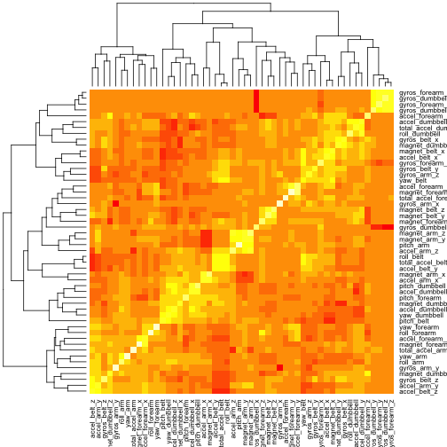
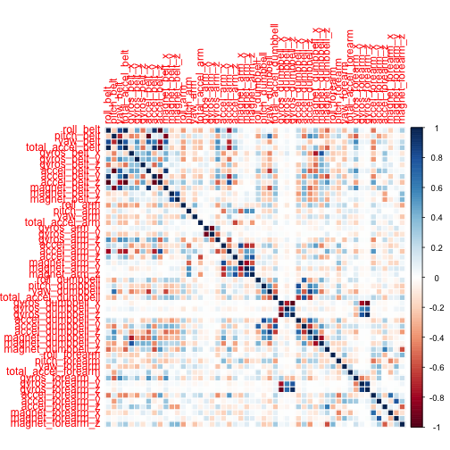
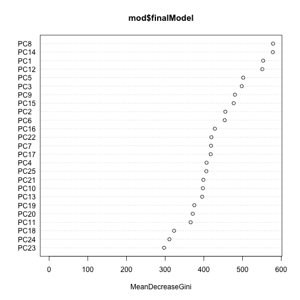

Practicle Machine Learning Project
=================================

## Background:  

One thing that people regularly do is quantify how much of a particular activity they do, but they rarely quantify how well they do it. In this project, your goal will be to use data from accelerometers on the belt, forearm, arm, and dumbell of 6 participants. In this test, people were asked to perform barbell lifts correctly and incorrectly in 5 different ways. 

The data is available at: http://groupware.les.inf.puc-rio.br/har (section on the Weight Lifting Exercise Dataset). 
The training set data is available at: https://d396qusza40orc.cloudfront.net/predmachlearn/pml-training.csv
The testing set is available at: https://d396qusza40orc.cloudfront.net/predmachlearn/pml-testing.csv

## Data loading:


```r
fileUrl <- "https://d396qusza40orc.cloudfront.net/predmachlearn/pml-training.csv"
download.file(fileUrl, destfile = "training.csv", method = "curl")
fileUrl <- "https://d396qusza40orc.cloudfront.net/predmachlearn/pml-testing.csv"
download.file(fileUrl, destfile = "test.csv", method = "curl")
list.files()
```

```
## [1] "Project.R"        "figure"           "pml_project.Rmd" 
## [4] "pml_project.html" "pml_project.md"   "submission.R"    
## [7] "test.csv"         "training.csv"
```

```r
train_data <- read.table("training.csv", sep = ",", header = TRUE)
test_data <- read.table("test.csv", sep = ",", header = TRUE)

names(train_data)
```

```
##   [1] "X"                        "user_name"               
##   [3] "raw_timestamp_part_1"     "raw_timestamp_part_2"    
##   [5] "cvtd_timestamp"           "new_window"              
##   [7] "num_window"               "roll_belt"               
##   [9] "pitch_belt"               "yaw_belt"                
##  [11] "total_accel_belt"         "kurtosis_roll_belt"      
##  [13] "kurtosis_picth_belt"      "kurtosis_yaw_belt"       
##  [15] "skewness_roll_belt"       "skewness_roll_belt.1"    
##  [17] "skewness_yaw_belt"        "max_roll_belt"           
##  [19] "max_picth_belt"           "max_yaw_belt"            
##  [21] "min_roll_belt"            "min_pitch_belt"          
##  [23] "min_yaw_belt"             "amplitude_roll_belt"     
##  [25] "amplitude_pitch_belt"     "amplitude_yaw_belt"      
##  [27] "var_total_accel_belt"     "avg_roll_belt"           
##  [29] "stddev_roll_belt"         "var_roll_belt"           
##  [31] "avg_pitch_belt"           "stddev_pitch_belt"       
##  [33] "var_pitch_belt"           "avg_yaw_belt"            
##  [35] "stddev_yaw_belt"          "var_yaw_belt"            
##  [37] "gyros_belt_x"             "gyros_belt_y"            
##  [39] "gyros_belt_z"             "accel_belt_x"            
##  [41] "accel_belt_y"             "accel_belt_z"            
##  [43] "magnet_belt_x"            "magnet_belt_y"           
##  [45] "magnet_belt_z"            "roll_arm"                
##  [47] "pitch_arm"                "yaw_arm"                 
##  [49] "total_accel_arm"          "var_accel_arm"           
##  [51] "avg_roll_arm"             "stddev_roll_arm"         
##  [53] "var_roll_arm"             "avg_pitch_arm"           
##  [55] "stddev_pitch_arm"         "var_pitch_arm"           
##  [57] "avg_yaw_arm"              "stddev_yaw_arm"          
##  [59] "var_yaw_arm"              "gyros_arm_x"             
##  [61] "gyros_arm_y"              "gyros_arm_z"             
##  [63] "accel_arm_x"              "accel_arm_y"             
##  [65] "accel_arm_z"              "magnet_arm_x"            
##  [67] "magnet_arm_y"             "magnet_arm_z"            
##  [69] "kurtosis_roll_arm"        "kurtosis_picth_arm"      
##  [71] "kurtosis_yaw_arm"         "skewness_roll_arm"       
##  [73] "skewness_pitch_arm"       "skewness_yaw_arm"        
##  [75] "max_roll_arm"             "max_picth_arm"           
##  [77] "max_yaw_arm"              "min_roll_arm"            
##  [79] "min_pitch_arm"            "min_yaw_arm"             
##  [81] "amplitude_roll_arm"       "amplitude_pitch_arm"     
##  [83] "amplitude_yaw_arm"        "roll_dumbbell"           
##  [85] "pitch_dumbbell"           "yaw_dumbbell"            
##  [87] "kurtosis_roll_dumbbell"   "kurtosis_picth_dumbbell" 
##  [89] "kurtosis_yaw_dumbbell"    "skewness_roll_dumbbell"  
##  [91] "skewness_pitch_dumbbell"  "skewness_yaw_dumbbell"   
##  [93] "max_roll_dumbbell"        "max_picth_dumbbell"      
##  [95] "max_yaw_dumbbell"         "min_roll_dumbbell"       
##  [97] "min_pitch_dumbbell"       "min_yaw_dumbbell"        
##  [99] "amplitude_roll_dumbbell"  "amplitude_pitch_dumbbell"
## [101] "amplitude_yaw_dumbbell"   "total_accel_dumbbell"    
## [103] "var_accel_dumbbell"       "avg_roll_dumbbell"       
## [105] "stddev_roll_dumbbell"     "var_roll_dumbbell"       
## [107] "avg_pitch_dumbbell"       "stddev_pitch_dumbbell"   
## [109] "var_pitch_dumbbell"       "avg_yaw_dumbbell"        
## [111] "stddev_yaw_dumbbell"      "var_yaw_dumbbell"        
## [113] "gyros_dumbbell_x"         "gyros_dumbbell_y"        
## [115] "gyros_dumbbell_z"         "accel_dumbbell_x"        
## [117] "accel_dumbbell_y"         "accel_dumbbell_z"        
## [119] "magnet_dumbbell_x"        "magnet_dumbbell_y"       
## [121] "magnet_dumbbell_z"        "roll_forearm"            
## [123] "pitch_forearm"            "yaw_forearm"             
## [125] "kurtosis_roll_forearm"    "kurtosis_picth_forearm"  
## [127] "kurtosis_yaw_forearm"     "skewness_roll_forearm"   
## [129] "skewness_pitch_forearm"   "skewness_yaw_forearm"    
## [131] "max_roll_forearm"         "max_picth_forearm"       
## [133] "max_yaw_forearm"          "min_roll_forearm"        
## [135] "min_pitch_forearm"        "min_yaw_forearm"         
## [137] "amplitude_roll_forearm"   "amplitude_pitch_forearm" 
## [139] "amplitude_yaw_forearm"    "total_accel_forearm"     
## [141] "var_accel_forearm"        "avg_roll_forearm"        
## [143] "stddev_roll_forearm"      "var_roll_forearm"        
## [145] "avg_pitch_forearm"        "stddev_pitch_forearm"    
## [147] "var_pitch_forearm"        "avg_yaw_forearm"         
## [149] "stddev_yaw_forearm"       "var_yaw_forearm"         
## [151] "gyros_forearm_x"          "gyros_forearm_y"         
## [153] "gyros_forearm_z"          "accel_forearm_x"         
## [155] "accel_forearm_y"          "accel_forearm_z"         
## [157] "magnet_forearm_x"         "magnet_forearm_y"        
## [159] "magnet_forearm_z"         "classe"
```

```r
head(test_data)
```

```
##   X user_name raw_timestamp_part_1 raw_timestamp_part_2   cvtd_timestamp
## 1 1     pedro           1323095002               868349 05/12/2011 14:23
## 2 2    jeremy           1322673067               778725 30/11/2011 17:11
## 3 3    jeremy           1322673075               342967 30/11/2011 17:11
## 4 4    adelmo           1322832789               560311 02/12/2011 13:33
## 5 5    eurico           1322489635               814776 28/11/2011 14:13
## 6 6    jeremy           1322673149               510661 30/11/2011 17:12
##   new_window num_window roll_belt pitch_belt yaw_belt total_accel_belt
## 1         no         74    123.00      27.00    -4.75               20
## 2         no        431      1.02       4.87   -88.90                4
## 3         no        439      0.87       1.82   -88.50                5
## 4         no        194    125.00     -41.60   162.00               17
## 5         no        235      1.35       3.33   -88.60                3
## 6         no        504     -5.92       1.59   -87.70                4
##   kurtosis_roll_belt kurtosis_picth_belt kurtosis_yaw_belt
## 1                 NA                  NA                NA
## 2                 NA                  NA                NA
## 3                 NA                  NA                NA
## 4                 NA                  NA                NA
## 5                 NA                  NA                NA
## 6                 NA                  NA                NA
##   skewness_roll_belt skewness_roll_belt.1 skewness_yaw_belt max_roll_belt
## 1                 NA                   NA                NA            NA
## 2                 NA                   NA                NA            NA
## 3                 NA                   NA                NA            NA
## 4                 NA                   NA                NA            NA
## 5                 NA                   NA                NA            NA
## 6                 NA                   NA                NA            NA
##   max_picth_belt max_yaw_belt min_roll_belt min_pitch_belt min_yaw_belt
## 1             NA           NA            NA             NA           NA
## 2             NA           NA            NA             NA           NA
## 3             NA           NA            NA             NA           NA
## 4             NA           NA            NA             NA           NA
## 5             NA           NA            NA             NA           NA
## 6             NA           NA            NA             NA           NA
##   amplitude_roll_belt amplitude_pitch_belt amplitude_yaw_belt
## 1                  NA                   NA                 NA
## 2                  NA                   NA                 NA
## 3                  NA                   NA                 NA
## 4                  NA                   NA                 NA
## 5                  NA                   NA                 NA
## 6                  NA                   NA                 NA
##   var_total_accel_belt avg_roll_belt stddev_roll_belt var_roll_belt
## 1                   NA            NA               NA            NA
## 2                   NA            NA               NA            NA
## 3                   NA            NA               NA            NA
## 4                   NA            NA               NA            NA
## 5                   NA            NA               NA            NA
## 6                   NA            NA               NA            NA
##   avg_pitch_belt stddev_pitch_belt var_pitch_belt avg_yaw_belt
## 1             NA                NA             NA           NA
## 2             NA                NA             NA           NA
## 3             NA                NA             NA           NA
## 4             NA                NA             NA           NA
## 5             NA                NA             NA           NA
## 6             NA                NA             NA           NA
##   stddev_yaw_belt var_yaw_belt gyros_belt_x gyros_belt_y gyros_belt_z
## 1              NA           NA        -0.50        -0.02        -0.46
## 2              NA           NA        -0.06        -0.02        -0.07
## 3              NA           NA         0.05         0.02         0.03
## 4              NA           NA         0.11         0.11        -0.16
## 5              NA           NA         0.03         0.02         0.00
## 6              NA           NA         0.10         0.05        -0.13
##   accel_belt_x accel_belt_y accel_belt_z magnet_belt_x magnet_belt_y
## 1          -38           69         -179           -13           581
## 2          -13           11           39            43           636
## 3            1           -1           49            29           631
## 4           46           45         -156           169           608
## 5           -8            4           27            33           566
## 6          -11          -16           38            31           638
##   magnet_belt_z roll_arm pitch_arm yaw_arm total_accel_arm var_accel_arm
## 1          -382     40.7    -27.80     178              10            NA
## 2          -309      0.0      0.00       0              38            NA
## 3          -312      0.0      0.00       0              44            NA
## 4          -304   -109.0     55.00    -142              25            NA
## 5          -418     76.1      2.76     102              29            NA
## 6          -291      0.0      0.00       0              14            NA
##   avg_roll_arm stddev_roll_arm var_roll_arm avg_pitch_arm stddev_pitch_arm
## 1           NA              NA           NA            NA               NA
## 2           NA              NA           NA            NA               NA
## 3           NA              NA           NA            NA               NA
## 4           NA              NA           NA            NA               NA
## 5           NA              NA           NA            NA               NA
## 6           NA              NA           NA            NA               NA
##   var_pitch_arm avg_yaw_arm stddev_yaw_arm var_yaw_arm gyros_arm_x
## 1            NA          NA             NA          NA       -1.65
## 2            NA          NA             NA          NA       -1.17
## 3            NA          NA             NA          NA        2.10
## 4            NA          NA             NA          NA        0.22
## 5            NA          NA             NA          NA       -1.96
## 6            NA          NA             NA          NA        0.02
##   gyros_arm_y gyros_arm_z accel_arm_x accel_arm_y accel_arm_z magnet_arm_x
## 1        0.48       -0.18          16          38          93         -326
## 2        0.85       -0.43        -290         215         -90         -325
## 3       -1.36        1.13        -341         245         -87         -264
## 4       -0.51        0.92        -238         -57           6         -173
## 5        0.79       -0.54        -197         200         -30         -170
## 6        0.05       -0.07         -26         130         -19          396
##   magnet_arm_y magnet_arm_z kurtosis_roll_arm kurtosis_picth_arm
## 1          385          481                NA                 NA
## 2          447          434                NA                 NA
## 3          474          413                NA                 NA
## 4          257          633                NA                 NA
## 5          275          617                NA                 NA
## 6          176          516                NA                 NA
##   kurtosis_yaw_arm skewness_roll_arm skewness_pitch_arm skewness_yaw_arm
## 1               NA                NA                 NA               NA
## 2               NA                NA                 NA               NA
## 3               NA                NA                 NA               NA
## 4               NA                NA                 NA               NA
## 5               NA                NA                 NA               NA
## 6               NA                NA                 NA               NA
##   max_roll_arm max_picth_arm max_yaw_arm min_roll_arm min_pitch_arm
## 1           NA            NA          NA           NA            NA
## 2           NA            NA          NA           NA            NA
## 3           NA            NA          NA           NA            NA
## 4           NA            NA          NA           NA            NA
## 5           NA            NA          NA           NA            NA
## 6           NA            NA          NA           NA            NA
##   min_yaw_arm amplitude_roll_arm amplitude_pitch_arm amplitude_yaw_arm
## 1          NA                 NA                  NA                NA
## 2          NA                 NA                  NA                NA
## 3          NA                 NA                  NA                NA
## 4          NA                 NA                  NA                NA
## 5          NA                 NA                  NA                NA
## 6          NA                 NA                  NA                NA
##   roll_dumbbell pitch_dumbbell yaw_dumbbell kurtosis_roll_dumbbell
## 1        -17.74          24.96       126.24                     NA
## 2         54.48         -53.70       -75.51                     NA
## 3         57.07         -51.37       -75.20                     NA
## 4         43.11         -30.05      -103.32                     NA
## 5       -101.38         -53.44       -14.20                     NA
## 6         62.19         -50.56       -71.12                     NA
##   kurtosis_picth_dumbbell kurtosis_yaw_dumbbell skewness_roll_dumbbell
## 1                      NA                    NA                     NA
## 2                      NA                    NA                     NA
## 3                      NA                    NA                     NA
## 4                      NA                    NA                     NA
## 5                      NA                    NA                     NA
## 6                      NA                    NA                     NA
##   skewness_pitch_dumbbell skewness_yaw_dumbbell max_roll_dumbbell
## 1                      NA                    NA                NA
## 2                      NA                    NA                NA
## 3                      NA                    NA                NA
## 4                      NA                    NA                NA
## 5                      NA                    NA                NA
## 6                      NA                    NA                NA
##   max_picth_dumbbell max_yaw_dumbbell min_roll_dumbbell min_pitch_dumbbell
## 1                 NA               NA                NA                 NA
## 2                 NA               NA                NA                 NA
## 3                 NA               NA                NA                 NA
## 4                 NA               NA                NA                 NA
## 5                 NA               NA                NA                 NA
## 6                 NA               NA                NA                 NA
##   min_yaw_dumbbell amplitude_roll_dumbbell amplitude_pitch_dumbbell
## 1               NA                      NA                       NA
## 2               NA                      NA                       NA
## 3               NA                      NA                       NA
## 4               NA                      NA                       NA
## 5               NA                      NA                       NA
## 6               NA                      NA                       NA
##   amplitude_yaw_dumbbell total_accel_dumbbell var_accel_dumbbell
## 1                     NA                    9                 NA
## 2                     NA                   31                 NA
## 3                     NA                   29                 NA
## 4                     NA                   18                 NA
## 5                     NA                    4                 NA
## 6                     NA                   29                 NA
##   avg_roll_dumbbell stddev_roll_dumbbell var_roll_dumbbell
## 1                NA                   NA                NA
## 2                NA                   NA                NA
## 3                NA                   NA                NA
## 4                NA                   NA                NA
## 5                NA                   NA                NA
## 6                NA                   NA                NA
##   avg_pitch_dumbbell stddev_pitch_dumbbell var_pitch_dumbbell
## 1                 NA                    NA                 NA
## 2                 NA                    NA                 NA
## 3                 NA                    NA                 NA
## 4                 NA                    NA                 NA
## 5                 NA                    NA                 NA
## 6                 NA                    NA                 NA
##   avg_yaw_dumbbell stddev_yaw_dumbbell var_yaw_dumbbell gyros_dumbbell_x
## 1               NA                  NA               NA             0.64
## 2               NA                  NA               NA             0.34
## 3               NA                  NA               NA             0.39
## 4               NA                  NA               NA             0.10
## 5               NA                  NA               NA             0.29
## 6               NA                  NA               NA            -0.59
##   gyros_dumbbell_y gyros_dumbbell_z accel_dumbbell_x accel_dumbbell_y
## 1             0.06            -0.61               21              -15
## 2             0.05            -0.71             -153              155
## 3             0.14            -0.34             -141              155
## 4            -0.02             0.05              -51               72
## 5            -0.47            -0.46              -18              -30
## 6             0.80             1.10             -138              166
##   accel_dumbbell_z magnet_dumbbell_x magnet_dumbbell_y magnet_dumbbell_z
## 1               81               523              -528               -56
## 2             -205              -502               388               -36
## 3             -196              -506               349                41
## 4             -148              -576               238                53
## 5               -5              -424               252               312
## 6             -186              -543               262                96
##   roll_forearm pitch_forearm yaw_forearm kurtosis_roll_forearm
## 1          141         49.30       156.0                    NA
## 2          109        -17.60       106.0                    NA
## 3          131        -32.60        93.0                    NA
## 4            0          0.00         0.0                    NA
## 5         -176         -2.16       -47.9                    NA
## 6          150          1.46        89.7                    NA
##   kurtosis_picth_forearm kurtosis_yaw_forearm skewness_roll_forearm
## 1                     NA                   NA                    NA
## 2                     NA                   NA                    NA
## 3                     NA                   NA                    NA
## 4                     NA                   NA                    NA
## 5                     NA                   NA                    NA
## 6                     NA                   NA                    NA
##   skewness_pitch_forearm skewness_yaw_forearm max_roll_forearm
## 1                     NA                   NA               NA
## 2                     NA                   NA               NA
## 3                     NA                   NA               NA
## 4                     NA                   NA               NA
## 5                     NA                   NA               NA
## 6                     NA                   NA               NA
##   max_picth_forearm max_yaw_forearm min_roll_forearm min_pitch_forearm
## 1                NA              NA               NA                NA
## 2                NA              NA               NA                NA
## 3                NA              NA               NA                NA
## 4                NA              NA               NA                NA
## 5                NA              NA               NA                NA
## 6                NA              NA               NA                NA
##   min_yaw_forearm amplitude_roll_forearm amplitude_pitch_forearm
## 1              NA                     NA                      NA
## 2              NA                     NA                      NA
## 3              NA                     NA                      NA
## 4              NA                     NA                      NA
## 5              NA                     NA                      NA
## 6              NA                     NA                      NA
##   amplitude_yaw_forearm total_accel_forearm var_accel_forearm
## 1                    NA                  33                NA
## 2                    NA                  39                NA
## 3                    NA                  34                NA
## 4                    NA                  43                NA
## 5                    NA                  24                NA
## 6                    NA                  43                NA
##   avg_roll_forearm stddev_roll_forearm var_roll_forearm avg_pitch_forearm
## 1               NA                  NA               NA                NA
## 2               NA                  NA               NA                NA
## 3               NA                  NA               NA                NA
## 4               NA                  NA               NA                NA
## 5               NA                  NA               NA                NA
## 6               NA                  NA               NA                NA
##   stddev_pitch_forearm var_pitch_forearm avg_yaw_forearm
## 1                   NA                NA              NA
## 2                   NA                NA              NA
## 3                   NA                NA              NA
## 4                   NA                NA              NA
## 5                   NA                NA              NA
## 6                   NA                NA              NA
##   stddev_yaw_forearm var_yaw_forearm gyros_forearm_x gyros_forearm_y
## 1                 NA              NA            0.74           -3.34
## 2                 NA              NA            1.12           -2.78
## 3                 NA              NA            0.18           -0.79
## 4                 NA              NA            1.38            0.69
## 5                 NA              NA           -0.75            3.10
## 6                 NA              NA           -0.88            4.26
##   gyros_forearm_z accel_forearm_x accel_forearm_y accel_forearm_z
## 1           -0.59            -110             267            -149
## 2           -0.18             212             297            -118
## 3            0.28             154             271            -129
## 4            1.80             -92             406             -39
## 5            0.80             131             -93             172
## 6            1.35             230             322            -144
##   magnet_forearm_x magnet_forearm_y magnet_forearm_z problem_id
## 1             -714              419              617          1
## 2             -237              791              873          2
## 3              -51              698              783          3
## 4             -233              783              521          4
## 5              375             -787               91          5
## 6             -300              800              884          6
```

```r
dim(train_data)
```

```
## [1] 19622   160
```

```r
dim(test_data)
```

```
## [1]  20 160
```

## Cleaning data (Removing NA's):


```r
clean_train <- train_data[, colSums(is.na(train_data)) == 0]
clean_test <- test_data[, colSums(is.na(test_data)) == 0]
```

## Discarding non useful variables:


```r
n_c_train_1 <- clean_train[, !grepl("X|user_name|timestamp|window", colnames(clean_train))]
n_c_test_1 <- clean_test[, !grepl("X|user_name|timestamp|window", colnames(clean_test))]

n_c_train_2 <- n_c_train_1[, !grepl("^max|^min|^ampl|^var|^avg|^stdd|^ske|^kurt", colnames(n_c_train_1))]
n_c_test_2 <- n_c_test_1[, !grepl("^max|^min|^ampl|^var|^avg|^stdd|^ske|^kurt", colnames(n_c_test_1))]
dim(n_c_train_2)
```

```
## [1] 19622    53
```

```r
dim(n_c_test_2)
```

```
## [1] 20 53
```

## Cross validation (70% training and 30% validation):


```r
set.seed(23222)
library(caret)
```

```
## Loading required package: lattice
## Loading required package: ggplot2
```

```r
in_train <- createDataPartition(y = n_c_train_2$classe, p = 0.7, list = FALSE)
train <- n_c_train_2[in_train, ]
train_valid <- n_c_train_2[-in_train, ]
n_c_test <- n_c_test_2
```
## Ploting data:


```r
train_corr <- cor(train[, -53])
heatmap(train_corr)
```

 

```r
library(corrplot)
corrplot(train_corr, method = "color")
```

 

Highly correlated variables

```r
h_c <- abs(train_corr)
diag(h_c) <- 0
h_corr <- which(h_c > 0.8, arr.ind = TRUE)
for (i in 1:nrow(h_corr)) {
  print(names(train)[h_corr[i, ]])
}
```

```
## [1] "yaw_belt"  "roll_belt"
## [1] "total_accel_belt" "roll_belt"       
## [1] "accel_belt_y" "roll_belt"   
## [1] "accel_belt_z" "roll_belt"   
## [1] "accel_belt_x" "pitch_belt"  
## [1] "magnet_belt_x" "pitch_belt"   
## [1] "roll_belt" "yaw_belt" 
## [1] "roll_belt"        "total_accel_belt"
## [1] "accel_belt_y"     "total_accel_belt"
## [1] "accel_belt_z"     "total_accel_belt"
## [1] "pitch_belt"   "accel_belt_x"
## [1] "magnet_belt_x" "accel_belt_x" 
## [1] "roll_belt"    "accel_belt_y"
## [1] "total_accel_belt" "accel_belt_y"    
## [1] "accel_belt_z" "accel_belt_y"
## [1] "roll_belt"    "accel_belt_z"
## [1] "total_accel_belt" "accel_belt_z"    
## [1] "accel_belt_y" "accel_belt_z"
## [1] "pitch_belt"    "magnet_belt_x"
## [1] "accel_belt_x"  "magnet_belt_x"
## [1] "gyros_arm_y" "gyros_arm_x"
## [1] "gyros_arm_x" "gyros_arm_y"
## [1] "magnet_arm_x" "accel_arm_x" 
## [1] "accel_arm_x"  "magnet_arm_x"
## [1] "magnet_arm_z" "magnet_arm_y"
## [1] "magnet_arm_y" "magnet_arm_z"
## [1] "accel_dumbbell_x" "pitch_dumbbell"  
## [1] "accel_dumbbell_z" "yaw_dumbbell"    
## [1] "gyros_dumbbell_z" "gyros_dumbbell_x"
## [1] "gyros_forearm_z"  "gyros_dumbbell_x"
## [1] "gyros_dumbbell_x" "gyros_dumbbell_z"
## [1] "gyros_forearm_z"  "gyros_dumbbell_z"
## [1] "pitch_dumbbell"   "accel_dumbbell_x"
## [1] "yaw_dumbbell"     "accel_dumbbell_z"
## [1] "gyros_forearm_z" "gyros_forearm_y"
## [1] "gyros_dumbbell_x" "gyros_forearm_z" 
## [1] "gyros_dumbbell_z" "gyros_forearm_z" 
## [1] "gyros_forearm_y" "gyros_forearm_z"
```

## PCA for combination of predictors to have reduced number of predictors and reduced noise:


```r
train_pca <- preProcess(train[, -53], method  = "pca", thresh = 0.95) # 0.9
train_pca_1 <- predict(train_pca, train[, -53])
valid_pca <- predict(train_pca, train_valid[, -53])
test_pca <- predict(train_pca, n_c_test[, -53])
print(train_pca)
```

```
## 
## Call:
## preProcess.default(x = train[, -53], method = "pca", thresh = 0.95)
## 
## Created from 13737 samples and 52 variables
## Pre-processing: principal component signal extraction, scaled, centered 
## 
## PCA needed 25 components to capture 95 percent of the variance
```

## Random forests for cross validation method:


```r
mod <- train(train$classe ~ ., method = "rf", data = train_pca_1, trControl = trainControl(method = "cv", 5)) # 5
```

```
## Loading required package: randomForest
## randomForest 4.6-7
## Type rfNews() to see new features/changes/bug fixes.
```

```r
mod
```

```
## Random Forest 
## 
## 13737 samples
##    24 predictors
##     5 classes: 'A', 'B', 'C', 'D', 'E' 
## 
## No pre-processing
## Resampling: Cross-Validated (5 fold) 
## 
## Summary of sample sizes: 10989, 10991, 10990, 10989, 10989 
## 
## Resampling results across tuning parameters:
## 
##   mtry  Accuracy  Kappa  Accuracy SD  Kappa SD
##   2     1         1      0.004        0.005   
##   10    1         1      0.005        0.006   
##   20    1         0.9    0.004        0.005   
## 
## Accuracy was used to select the optimal model using  the largest value.
## The final value used for the model was mtry = 2.
```

```r
varImpPlot(mod$finalModel, sort = TRUE)
```

 

## Cross validation:


```r
pred_valid <- predict(mod, valid_pca)
confusionMatrix(train_valid$classe, pred_valid)
```

```
## Confusion Matrix and Statistics
## 
##           Reference
## Prediction    A    B    C    D    E
##          A 1658    5    6    3    2
##          B   16 1109   14    0    0
##          C    1   13 1007    5    0
##          D    2    0   38  922    2
##          E    2   11    5    3 1061
## 
## Overall Statistics
##                                         
##                Accuracy : 0.978         
##                  95% CI : (0.974, 0.982)
##     No Information Rate : 0.285         
##     P-Value [Acc > NIR] : <2e-16        
##                                         
##                   Kappa : 0.972         
##  Mcnemar's Test P-Value : NA            
## 
## Statistics by Class:
## 
##                      Class: A Class: B Class: C Class: D Class: E
## Sensitivity             0.987    0.975    0.941    0.988    0.996
## Specificity             0.996    0.994    0.996    0.992    0.996
## Pos Pred Value          0.990    0.974    0.981    0.956    0.981
## Neg Pred Value          0.995    0.994    0.987    0.998    0.999
## Prevalence              0.285    0.193    0.182    0.159    0.181
## Detection Rate          0.282    0.188    0.171    0.157    0.180
## Detection Prevalence    0.284    0.194    0.174    0.164    0.184
## Balanced Accuracy       0.992    0.984    0.969    0.990    0.996
```

```r
OoSE <- 1 - as.numeric(confusionMatrix(train_valid$classe, pred_valid)$overall[1])
pred_test <- predict(mod, test_pca)
```

